# TP1 — Créer des APIs REST simples en Node.js et Express.js

## 1. Introduction

L'objectif de ce TP est de créer une API REST complète en Node.js et Express.js pour gérer une ressource **Joueurs**. L'API permet d'effectuer toutes les opérations CRUD ainsi que des routes de recherche avancées. Les données sont stockées dans une base de données **MongoDB**.

---

## 2. Sommaire

1. Introduction
2. Stack technique
3. Structure du projet
4. Installation et lancement
5. Routes disponibles
6. Tests des routes
7. Conclusion
8. Bilan personnel

---

## 3. Stack technique

| Outil | Rôle |
|---|---|
| Node.js | Runtime JavaScript |
| Express.js | Framework HTTP |
| MongoDB | Base de données |
| Mongoose | ODM pour MongoDB |
| dotenv | Variables d'environnement |
| nodemon | Rechargement automatique |

---

## 4. Structure du projet
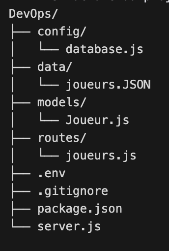

DevOps/
├── config/
│   └── database.js
├── data/
│   └── joueurs.JSON
├── models/
│   └── Joueur.js
├── routes/
│   └── joueurs.js
├── .env
├── .gitignore
├── package.json
└── server.js

---

## 5. Installation et lancement

```bash
git clone git@github.com:Arteinsana7/DevOps.git
cd DevOps
npm install
npm run dev
```

---

## 6. Routes disponibles

| Méthode | Route | Description |
|---|---|---|
| GET | `/api/joueurs` | Tous les joueurs |
| GET | `/api/joueurs/:id` | Un joueur par id |
| POST | `/api/joueurs` | Créer un joueur |
| PUT | `/api/joueurs/:id` | Modifier un joueur |
| DELETE | `/api/joueurs/:id` | Supprimer un joueur |
| GET | `/api/equipes/:id/joueurs` | Joueurs d'une équipe |
| GET | `/api/joueurs/:id/equipe` | Équipe d'un joueur |


---


## 7. Authentification JWT

### Comment ça marche ?

L'authentification fonctionne en 3 étapes :

1. **Register** — tu crées un compte avec un username et un mot de passe. Le mot de passe est automatiquement hashé avec bcrypt avant d'être stocké dans MongoDB.

2. **Login** — tu te connectes avec tes identifiants. Si c'est correct, le serveur génère un **token JWT** signé avec le `JWT_SECRET`. Ce token contient ton id et une date d'expiration (24h).

3. **Requêtes protégées** — pour accéder aux routes POST, PUT et DELETE, tu dois envoyer le token dans le header `Authorization: Bearer TOKEN`. Le middleware vérifie que le token est valide avant de laisser passer la requête.

> captures d'écran des tests curl 

## 8. Tests des routes

### GET tous les joueurs
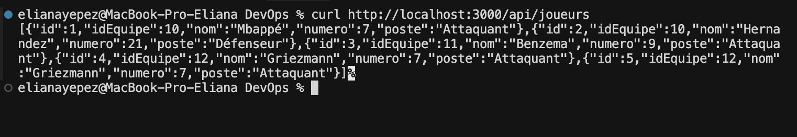

### GET un joueur par id
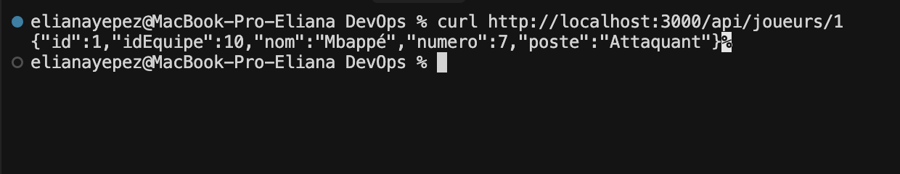

### GET search un joueur 
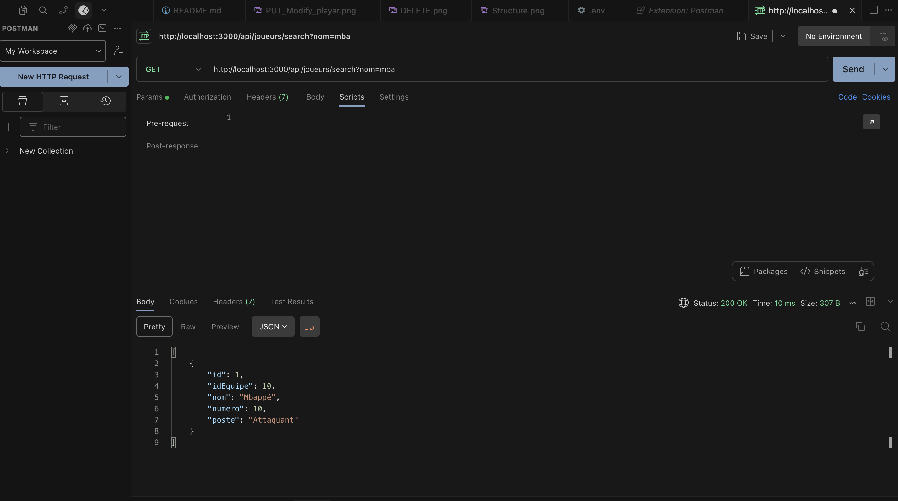

### GET EQUIPES
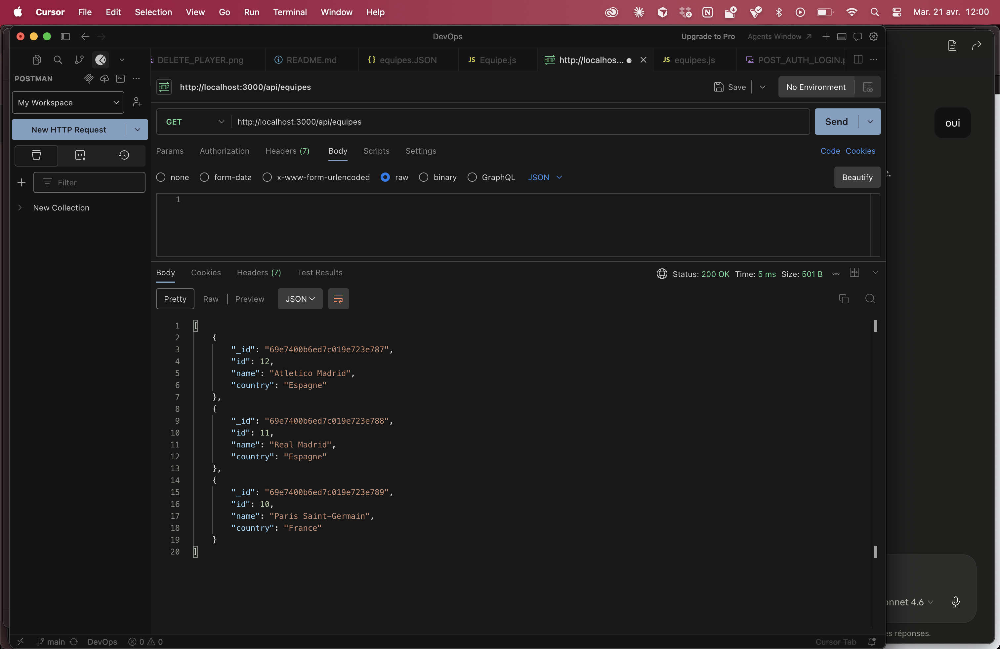

### GET EQUIPES By ID
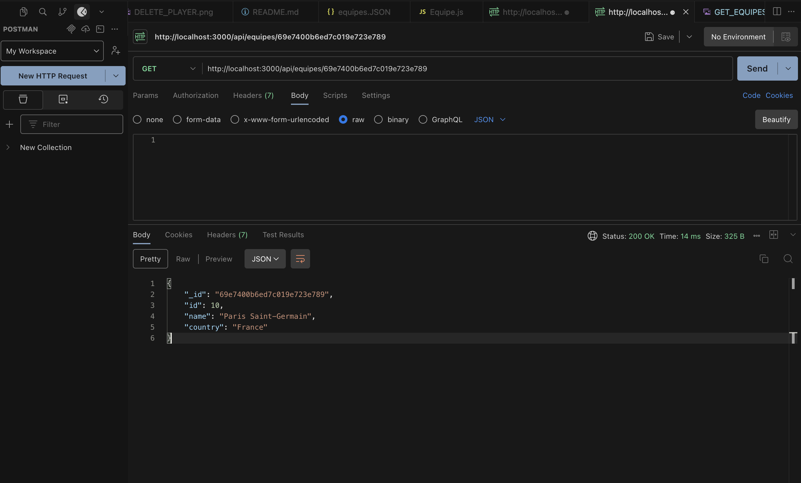

### POST EQUIPES


### POST créer un joueur une fois connecté (TOKEN)
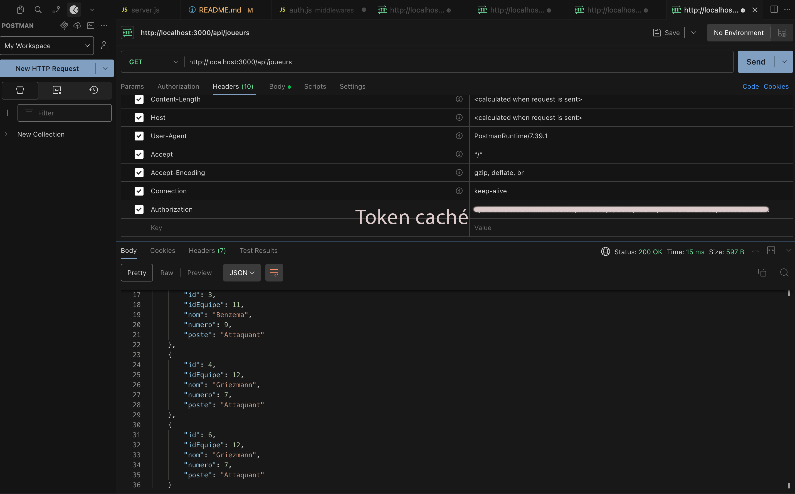

### POST cse connecter a son compte AUTH
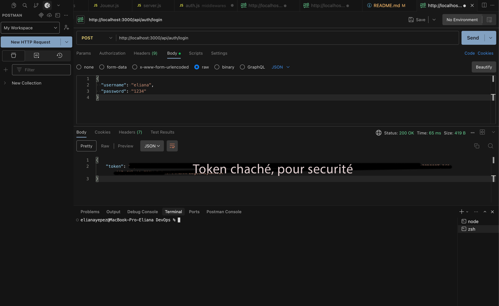

### POST créer un utilisateur
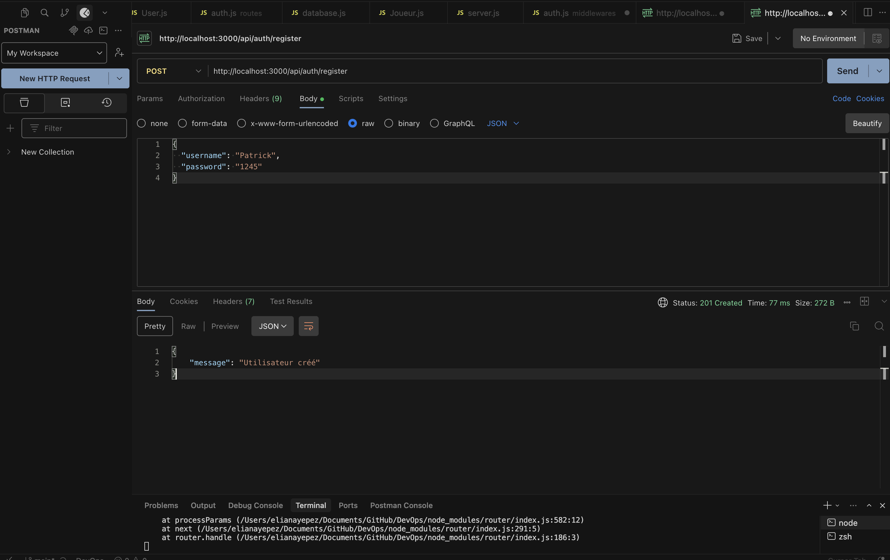

### PUT modifier un joueur
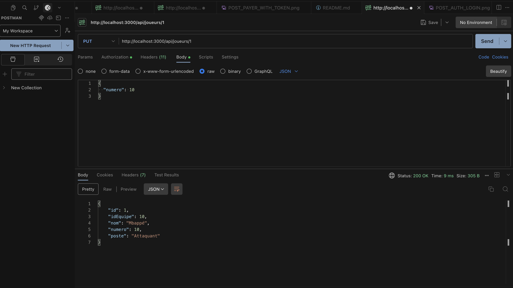

### DELETE supprimer un joueur
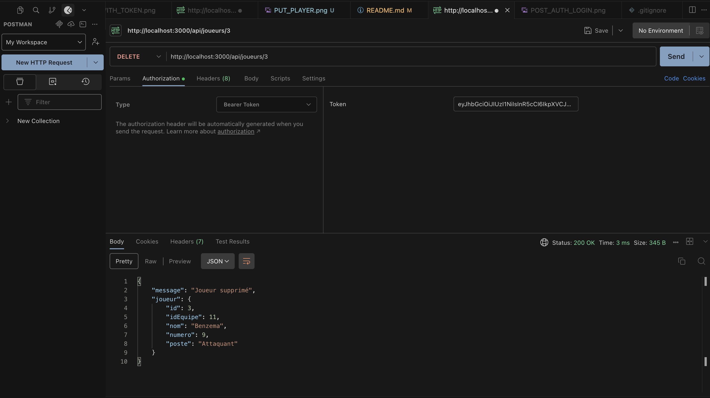


---

## 8. Conclusion

Ce TP a permis de mettre en place une API REST complète avec Node.js, Express.js et MongoDB. Les opérations CRUD sont fonctionnelles et les routes de recherche permettent de filtrer les joueurs par équipe ou par nom.

---

## 9. Bilan personnel

Ce TP m'a permis de comprendre les bases d'une API REST et le fonctionnement d'Express.js. J'ai appris à structurer un projet Node.js, connecter MongoDB avec Mongoose, et tester mes routes avec curl.