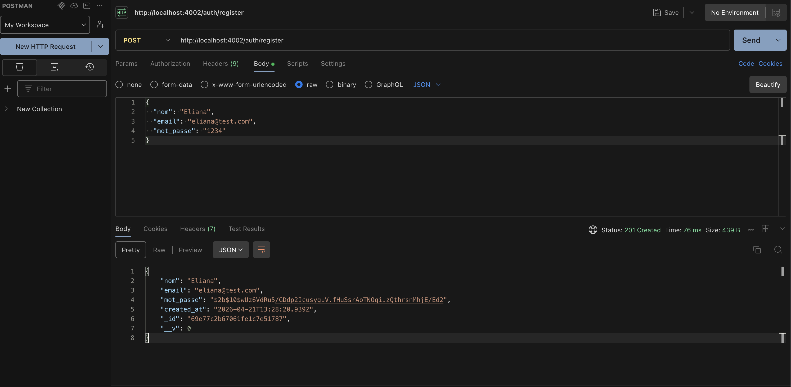
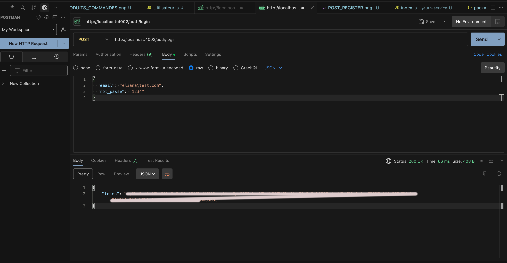
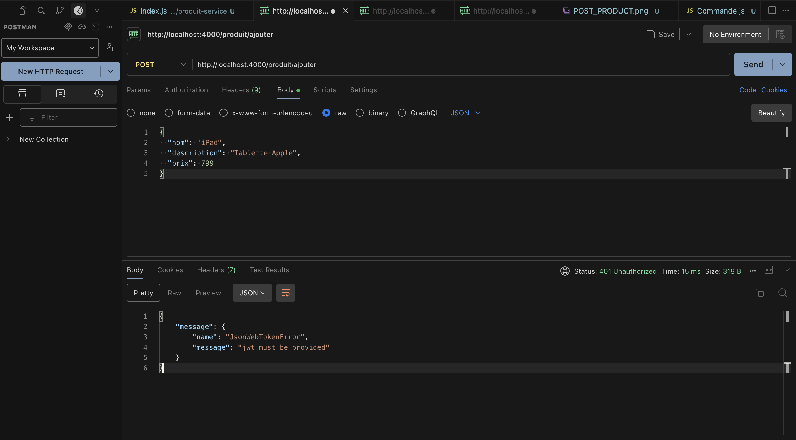
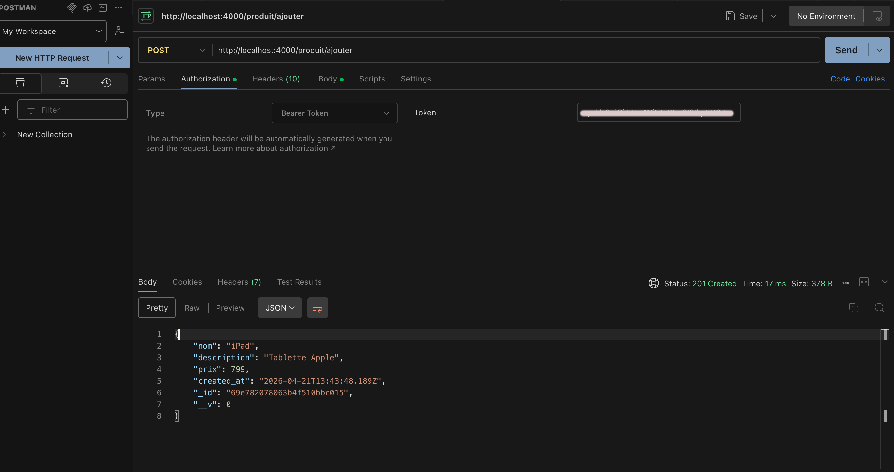
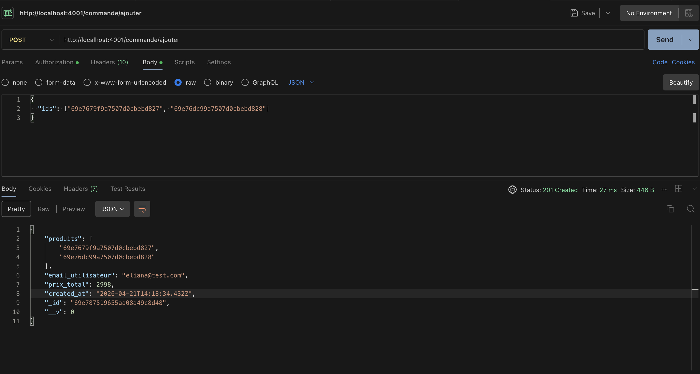
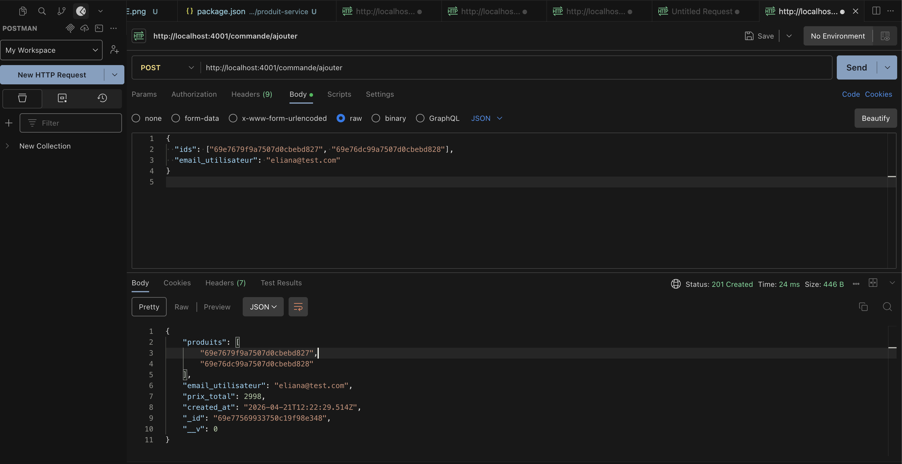
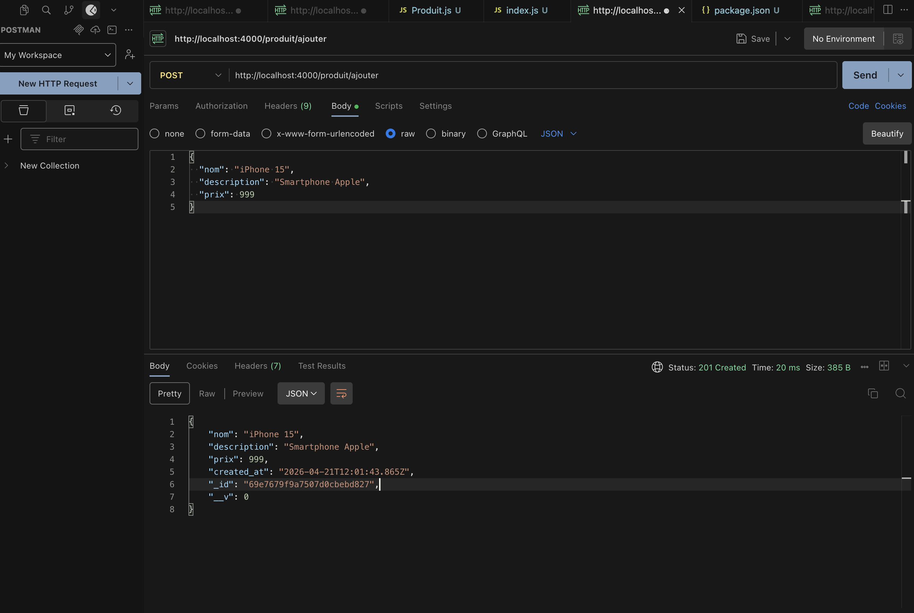
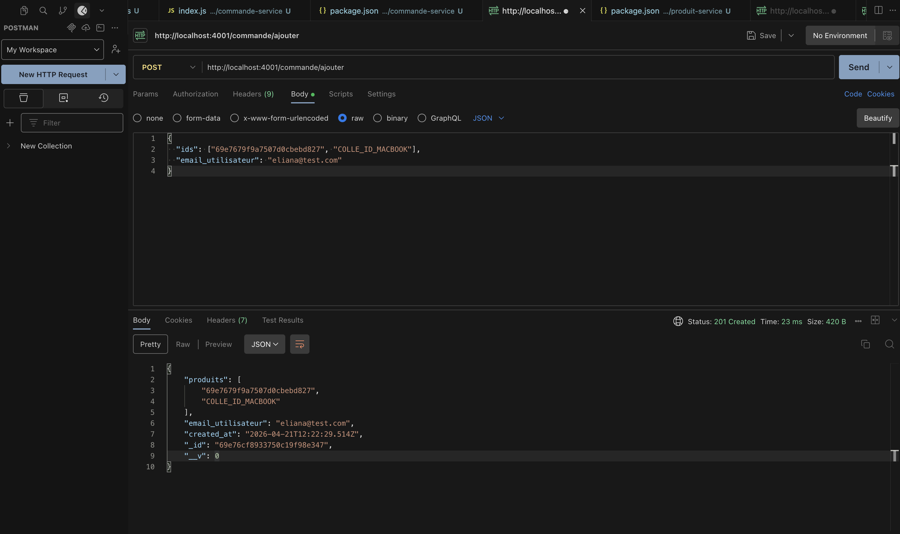

# TP2 — Créer des Microservices avec Node.js

## 1. Introduction

L'objectif de ce TP est de créer une application en architecture microservices avec Node.js et MongoDB. L'application est décomposée en 3 services indépendants qui communiquent entre eux via HTTP.

---

## 2. Sommaire

1. Introduction
2. Architecture
3. Stack technique
4. Structure du projet
5. Installation et lancement
6. Services et routes
7. Tests des routes
8. Conclusion
9. Bilan personnel

---

## 3. Architecture


Chaque service a sa propre base de données MongoDB.

---

## 4. Stack technique

| Outil | Rôle |
|---|---|
| Node.js | Runtime JavaScript |
| Express.js | Framework HTTP |
| MongoDB | Base de données |
| Mongoose | ODM pour MongoDB |
| Axios | Communication HTTP entre services |
| JWT | Authentification |
| bcryptjs | Hashage des mots de passe |
| nodemon | Rechargement automatique |

---

## 5. Structure du projet

TP2/
├── produit-service/        # Port 4000
│   ├── Produit.js
│   ├── isAuthenticated.js
│   └── index.js
├── commande-service/       # Port 4001
│   ├── Commande.js
│   ├── isAuthenticated.js
│   └── index.js
└── auth-service/           # Port 4002
├── Utilisateur.js
└── index.js


---

## 6. Services et routes

### Auth-service (port 4002)

| Méthode | Route | Description |
|---|---|---|
| POST | `/auth/register` | Créer un compte |
| POST | `/auth/login` | Se connecter et obtenir un token JWT |

### Produit-service (port 4000)

| Méthode | Route | Description | Auth |
|---|---|---|---|
| POST | `/produit/ajouter` | Ajouter un produit | ✅ |
| GET | `/produit/acheter` | Récupérer des produits par ids | ❌ |

### Commande-service (port 4001)

| Méthode | Route | Description | Auth |
|---|---|---|---|
| POST | `/commande/ajouter` | Créer une commande | ✅ |

---

## 7. Installation et lancement

### Prérequis
- Node.js
- MongoDB démarré

### Lancer les services

Ouvrir 3 terminaux :

```bash
# Terminal 1 - Auth service
cd auth-service
npm start

# Terminal 2 - Produit service
cd produit-service
npm start

# Terminal 3 - Commande service
cd commande-service
npm start
```

---
## 8. Tests des routes

### Register


### Login


### Erreur sans token


### Erreur sans token


### Avec token


### Ajouter un produit


### Créer une commande


### Produit créé


### Commande créée



---

## 9. Conclusion

Ce TP a permis de mettre en place une architecture microservices avec 3 services indépendants qui communiquent entre eux via HTTP. Le service commande appelle automatiquement le service produit pour calculer le prix total d'une commande.

---

## 10. Bilan personnel

Ce TP m'a permis de comprendre la différence entre une architecture monolithique et une architecture microservices. J'ai appris à faire communiquer des services indépendants via HTTP avec Axios, et à sécuriser les routes avec JWT partagé entre les services.